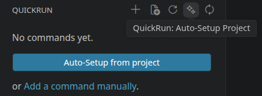

**Save and run any terminal command from the VS Code sidebar in one click.**

No more retyping long commands. Organise them into groups, pick an icon, and run instantly.

---
<!--  -->
<!-- 
 -->

 

*Stop retyping the same commands. Save them once, run them in one click.*

## 📦 Setup

**VS Code** — search for *QuickRun* in the Extensions panel, or install directly from the marketplace:

**VSCodium / Open VSX** — search for *QuickRun* in the Extensions panel, or install from Open VSX:

### ✨ Auto-Setup

Already have a project open? Let QuickRun configure itself automatically. Click the **Auto-Setup** button in the sidebar toolbar. QuickRun will use GitHub Copilot to analyse the workspace, find runnable commands across your project and then present a preview list for you to confirm before anything is added.

A **model picker** lets you choose which LLM model to use.

Once your sidebar is populated, the **Check for New Commands** button re-runs the analysis and shows only commands not yet in your sidebar.

> Auto-Setup requires GitHub Copilot extension to be installed and signed in.

## ✨ Features

| | |
|---|---|
| ▶ **One-click run** | Execute any command instantly from the sidebar panel |
| 🔍 **Command palette** | Run any saved command via `Ctrl+Shift+P`: *QuickRun: Run Command...*, grouped and searchable by name or shell command |
| 🔄 **Live status indicator** | Running commands show an animated spinner and a `running` badge so you always know what's active |
| 🖥 **Per-command terminal mode** | Choose per command: reuse the same terminal across runs, or always open a fresh one |
| 📁 **Groups** | Fold related commands together for a clean, organised panel |
| 🏠 **Project scope** | Save commands to `.vscode/quickrun.json` and commit them — your whole team shares them automatically |
| 🌐 **Global scope** | Save commands to VS Code settings so they follow you across every workspace |
| 🎨 **Icon picker** | Choose from 60+ VS Code codicons per command or group |

## 🚀 Getting Started

1. Click the **QuickRun icon** in the Activity Bar
2. Click **Auto-Setup** to populate the sidebar automatically, or **`+`** to add a command manually
3. Click the **▶ play** button next to any command to run it

## ⚙️ Configuration

Commands are stored in `.vscode/quickrun.json` (project scope, commit to share with your team) or in `settings.json` under the `quickrun.global` key (global scope, available in every workspace).

See [docs/configuration.md](docs/configuration.md) for the full JSON format and all available fields.

## ⚠️ Known Issues

### Terminal Multiplexers (tmux, screen, zellij)

If your shell automatically starts a terminal multiplexer like **tmux**, **screen**, or **zellij** on startup, VS Code inherits that environment when it launches. This can interfere with VS Code's shell integration, which QuickRun relies on to execute commands and detect when they finish. You may experience:

- Commands appearing not to run when clicking the play button
- Commands showing a permanent "running" indicator even after they have completed

If you run into this, try launching VS Code from a clean shell session outside the multiplexer, or temporarily disable auto-starting the multiplexer in your shell profile.

## 🤝 Contributing

Contributions, issues, and feature requests are welcome! Feel free to open an issue or submit a pull request.
****

Made with ❤️ by [Andrej Schwanke](https://github.com/Paraaa)

